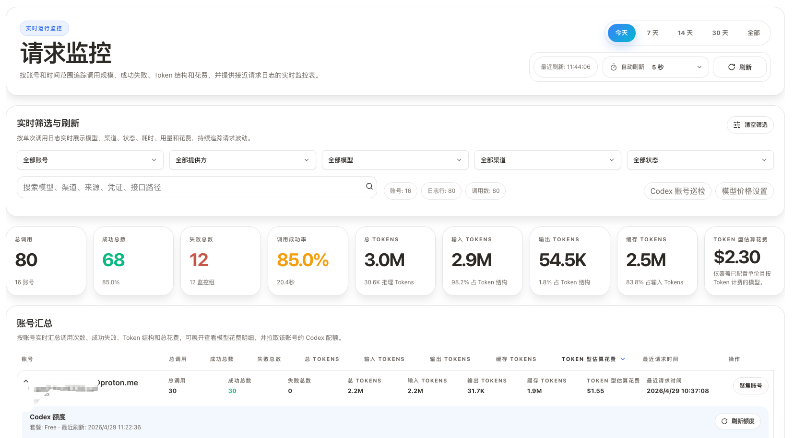
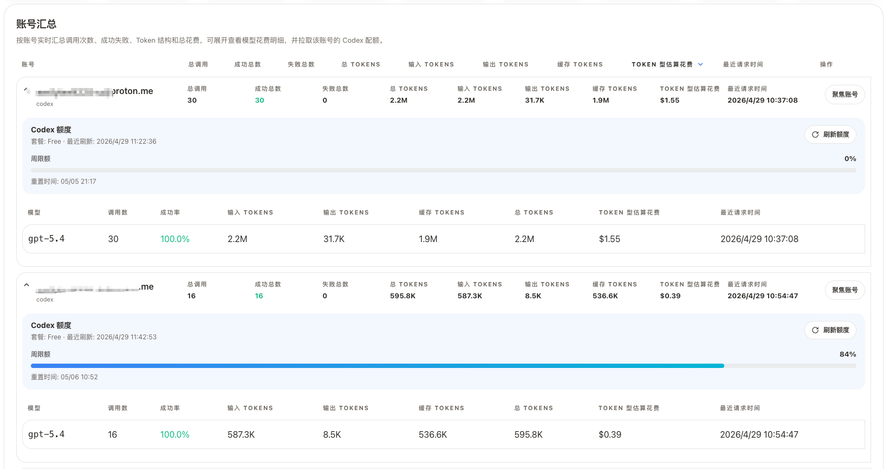
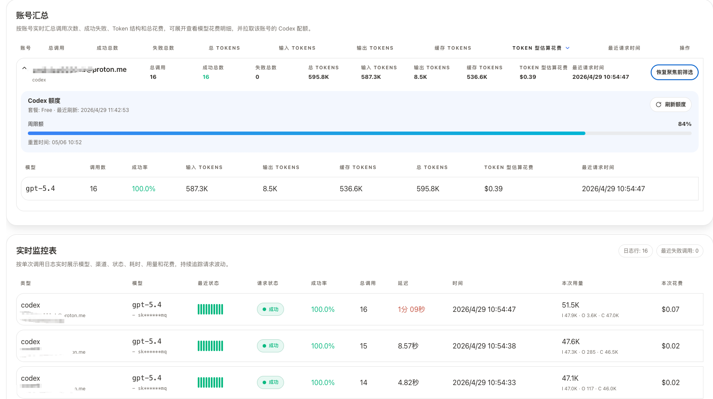

# CLI Proxy API 管理中心

这是一个面向 **CLI Proxy API** 的单文件 Web UI（React + TypeScript），通过 **Management API** 完成运维、观测与故障排查。

它把配置管理、提供商配置、认证文件、OAuth、配额、使用统计、运行时监控、日志和系统工具集中到一个界面里。

[English](README.md)

**主项目**: https://github.com/router-for-me/CLIProxyAPI  
**示例地址**: https://remote.router-for.me/  
**后端最低版本**: >= 6.8.0（推荐 >= 6.8.15）

从 `6.0.19` 开始，Web UI 会随主程序一起分发。服务启动后，可直接通过 API 端口访问 `/management.html`。

## 这是什么

- 本仓库只包含 Web 管理界面本身
- 它通过 CLI Proxy API 的 **Management API**（`/v0/management`）读取和修改运行状态
- 它 **不是** 代理本体，也不负责转发流量

## 当前分支亮点

### 请求监控中心

当前分支新增了 `/monitoring` 请求监控页面，重点解决运行时观测问题。

- 把 `/usage`、`auth-files`、`openai-compatibility` 三类数据聚合到一个视图
- 统一展示模型调用量、成功失败、Token 结构、延迟、估算花费、RPM/TPM 与近似任务桶
- 提供账号、模型、渠道、失败来源等多维拆解，并支持实时筛选和自动刷新
- 支持账号级下钻，以及按账号实时拉取 Codex 配额信息

### Codex 账号巡检

当前分支同时新增了 `/monitoring/codex-inspection`，用于 Codex 认证池的运维清理。

- 批量探测 Codex 账号状态
- 识别失效账号、额度耗尽账号和可恢复启用的禁用账号
- 为每个账号生成 `delete`、`disable`、`enable` 建议动作
- 支持批量执行、单条执行、抽样、并发、超时、重试以及巡检后自动执行
- 有后端 `clean` 配置时可继承默认值，同时把浏览器侧覆盖配置本地持久化

### 认证与账号兼容性增强

为了支撑上述功能，这个分支还补了几类兼容性改进：

- 更稳健的 Codex 账号 ID 解析
- 更完整的禁用状态识别
- `/api-call` 未返回明确状态码时的兜底处理
- 认证文件启用、禁用、删除流程的更多兼容分支

## 功能截图

当前分支新增的监控与巡检界面截图：







## 快速开始

### 方式 A：使用 CLI Proxy API 自带的 Web UI

1. 启动 CLI Proxy API 服务。
2. 打开 `http://<host>:<api_port>/management.html`。
3. 输入 **管理密钥** 并连接。

页面会根据当前 URL 自动推断 API 地址，也支持手动覆盖。

### 方式 B：本地开发调试

```bash
npm install
npm run dev
```

然后访问 `http://localhost:5173`，并连接你的 CLI Proxy API 后端实例。

### 方式 C：构建单文件 HTML

```bash
npm install
npm run build
```

- 输出文件：`dist/index.html`
- 资源会被内联为单文件
- 发布时可重命名为 `management.html`
- 本地预览：`npm run preview`

提示：直接通过 `file://` 打开 `dist/index.html` 可能会遇到浏览器 CORS 限制，建议通过本地 HTTP 服务访问。

## 连接说明

### API 地址

以下输入格式都会被自动归一化：

- `localhost:8317`
- `http://192.168.1.10:8317`
- `https://example.com:8317`
- `http://example.com:8317/v0/management`

### 管理密钥

管理密钥会以如下形式随请求发送：

- `Authorization: Bearer <MANAGEMENT_KEY>`

它和界面里配置的代理 `api-keys` 不是一回事。后者是给客户端访问代理接口时使用的鉴权 key。

### 远程管理

如果你是从非 localhost 浏览器访问，服务端需要允许远程管理，例如：

- `allow-remote-management: true`

认证规则、访问频率限制和远程访问封禁由服务端负责。

## 功能概览

- **仪表盘**
  - 展示连接状态、后端版本、构建时间与快速健康概览
- **配置管理**
  - 包括调试开关、代理地址、重试、配额回退、使用统计、请求日志、文件日志、WebSocket 鉴权，以及浏览器内编辑 `/config.yaml`
- **AI 提供商**
  - 覆盖 Gemini、Codex、Claude、Vertex、OpenAI 兼容渠道以及 Ampcode 集成
- **认证文件**
  - 支持上传、下载、删除、搜索、分页、runtime-only 标识、启用禁用流程、OAuth 排除模型与 OAuth 模型别名映射
- **OAuth**
  - 支持 OAuth 和设备码流程，并包含 iFlow Cookie 导入
- **配额管理**
  - 管理 Claude、Antigravity、Codex、Gemini CLI 等提供商的配额视图与相关操作
- **请求监控**
  - 提供运行时 KPI、趋势图、Token 结构、模型与渠道排行、失败焦点、账号汇总、实时筛选和准实时监控表
- **Codex 账号巡检**
  - 提供 Codex 认证池的巡检与清理工作流
- **使用统计**
  - 提供使用趋势、API 和模型拆分、缓存与推理 Token、导入导出，以及基于本地模型单价的费用估算
- **日志**
  - 支持增量追踪、自动刷新、搜索、隐藏管理流量、清空日志与错误日志下载
- **系统信息**
  - 提供快捷入口、本地状态清理工具，以及按分组展示 `/v1/models`

## 使用说明补充

- 请求监控依赖 `/usage` 数据。如果后端未启用使用统计，该页面只能展示有限的连接和配置状态。
- “日志”导航项只会在开启文件日志后显示。
- 认证文件相关功能是否完整可用，取决于后端是否支持对应接口和返回结构。
- Codex 账号巡检会在执行动作时修改认证文件状态，包含删除、禁用、启用，执行前应先确认建议结果。

## 技术栈

- React 19 + TypeScript 5.9
- Vite 7（单文件输出）
- Zustand
- Axios
- react-router-dom v7
- Chart.js
- CodeMirror 6
- SCSS Modules
- i18next

## 多语言支持

当前支持四种语言：

- 英文（`en`）
- 简体中文（`zh-CN`）
- 繁体中文（`zh-TW`）
- 俄文（`ru`）

界面语言会根据浏览器自动识别，也可以在 UI 中手动切换。

## 浏览器兼容性

- 构建目标：`ES2020`
- 支持现代版 Chrome、Firefox、Safari、Edge
- 兼容桌面、平板和移动端访问

## 构建与发布说明

- Vite 输出单文件 `dist/index.html`
- 资源通过 `vite-plugin-singlefile` 内联
- 打 `vX.Y.Z` 标签会触发 `.github/workflows/release.yml` 发布 `dist/management.html`
- 页脚 UI 版本会在构建时从 `VERSION`、git tag 或 `package.json` 注入

## 安全提示

- 管理密钥会保存在浏览器 `localStorage`，并使用轻量混淆格式（`enc::v1::...`），但仍应按敏感信息处理。
- 请求监控与巡检页面会暴露账号标签、接口路径、模型和使用量数据，建议仅在可信设备和浏览器环境中使用。
- 开启远程管理或执行删除类认证文件动作前，请先确认暴露面与影响范围。

## 常见问题

- **无法连接 / 401**：先确认 API 地址和管理密钥是否正确；远程访问还可能要求服务端开启远程管理。
- **请求监控页面为空**：检查后端是否开启使用统计；没有 `/usage` 数据时，运行时分析无法完整展示。
- **Codex 巡检结果不完整**：确认目标认证文件是否暴露了可用的 `auth_index`，以及后端是否允许管理端探测请求。
- **日志页没有出现**：先在配置里开启文件日志。
- **部分功能表现为不支持**：通常是后端版本较旧、接口不存在，或返回结构和当前 UI 兼容路径不完全一致。
- **OpenAI 提供商测试失败**：该测试运行在浏览器侧，会受到网络和 CORS 影响，这不一定表示后端无法访问提供商。

## 开发命令

```bash
npm run dev        # 启动 Vite 开发服务器
npm run build      # tsc + Vite 构建
npm run preview    # 本地预览 dist
npm run lint       # ESLint
npm run format     # 格式化 src/*
npm run type-check # tsc --noEmit
```

## 贡献

欢迎提交 Issue 和 PR。建议附上：

- 复现步骤
- 后端版本与 UI 版本
- UI 改动截图
- `npm run lint`、`npm run type-check` 等验证记录

## 许可证

MIT
